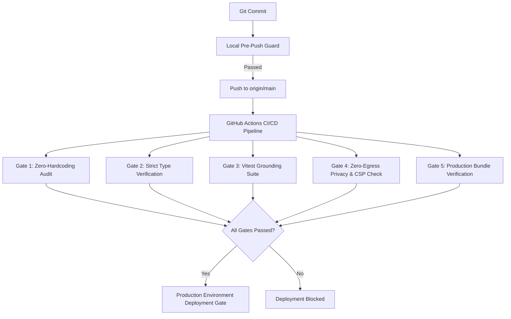

# ProtocolX — Deployment Protection & Security Gates

This repository enforces an automated, multi-tiered **Deployment Protection Architecture** to guarantee that every release meets strict privacy, zero-hardcoding, type safety, and real-time execution standards.

---

## 1. Automated Protection Gates



### Gate 1: Zero-Hardcoding & No-Mock Policy
* **Command:** `npm run audit:hardcode`
* **Enforcement:** Scans all source files against prohibited literals:
  * Prohibits canned summaries or mock data.
  * Prohibits hardcoded participant names (`Alice`, `Bob`).
  * Prohibits artificial urgency arrays or synthetic dates.
  * Enforces zero emojis across code and interface.

### Gate 2: Strict TypeScript Safety
* **Command:** `npx tsc --noEmit`
* **Enforcement:** Strict type-checking with zero implicit any, full schema conformance for all extracted entities (`Message`, `Item`, `ConversationState`, `TriageSummary`).

### Gate 3: Vitest Grounding & Edge Case Suite
* **Command:** `npm test`
* **Enforcement:** Executes all 31 test suites:
  * WhatsApp bracketed format normalization
  * Temporal anchor and deadline resolution
  * Unread cursor resolution
  * Ghosted thread detection (44 unreturned communication threads)
  * Collaboration Wrapped analytics engine
  * Grounding verifier ensuring 100% of claims cite verbatim source substrings

### Gate 4: Zero-Egress Privacy & CSP Directives
* **Script:** `scripts/deploy-guard.mjs`
* **Enforcement:** Verifies that:
  1. `index.html` contains an immutable `Content-Security-Policy` restricting all network traffic exclusively to local loopback (`127.0.0.1:*`, `localhost:*`, `'self'`).
  2. Insecure wildcard domains (`https://*`, `http://*`) are strictly blocked.
  3. `src/security/egressGuard.ts` is installed to intercept and log any accidental external network calls.

### Gate 5: Production Bundle Build Verification
* **Command:** `npm run build`
* **Enforcement:** Compiles optimized, minified production assets with tree shaking and gzip validation.

---

## 2. GitHub Environment Protection Rules

Under GitHub repository settings (**Settings > Environments > production**):
1. **Required Reviewers:** Requires designated technical sign-off prior to releasing to production.
2. **Deployment Branches:** Restricted strictly to `refs/heads/main`.
3. **Wait Timer:** Optional 5-minute cool-down period for automated security scanners.

---

## 3. Local Verification

To test and verify all deployment protection gates locally prior to pushing:

```bash
npm run deploy:check
```
